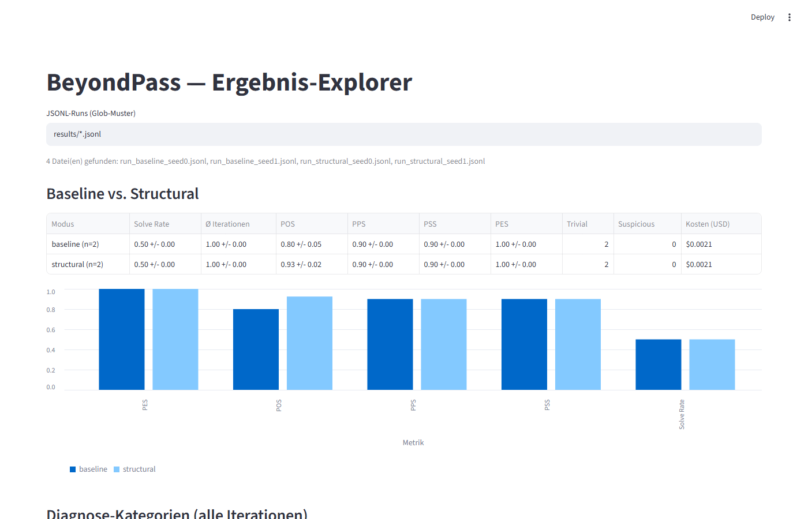

# BeyondPass

**Multi-Agent Code Synthesis with Structurally-Grounded Feedback**

[](https://www.python.org/)
[](LICENSE)
[]()

BeyondPass is a multi-agent system that solves programming tasks through iterative code generation - but instead of relying on a plain pass/fail signal, it diagnoses *why* a candidate solution is wrong using structural program metrics, and turns that diagnosis into targeted feedback for the next attempt.

It is a direct continuation of my Bachelor thesis, [*"Beyond Accuracy: Measuring Intelligence in Programming by Example"*](docs/Thesis.pdf) (TU Clausthal, 2026), which introduced four token-based metrics to compare a generated program against a reference program rather than only comparing outputs. This project asks the natural next question the thesis leaves open: **can those same metrics be used not just to measure a solution, but to actively guide an agent toward a better one?**

---

## Table of Contents

- [Project Status](#project-status)
- [The Problem](#the-problem)
- [The Approach](#the-approach)
- [Architecture](#architecture)
- [What's Being Measured](#whats-being-measured)
- [Results](#results)
- [Key Design Constraints](#key-design-constraints)
- [Getting Started](#getting-started)
- [Usage](#usage)
- [Dashboard](#dashboard)
- [Project Structure](#project-structure)
- [Tech Stack](#tech-stack)
- [Testing](#testing)
- [Limitations](#limitations)
- [Relation to the Thesis](#relation-to-the-thesis)
- [License](#license)

---

## Project Status

The system is being built in four work packages. **Foundation, metrics, the agent loop, and the reporting tool are all done and tested; the only thing missing is a paid API key to run real evaluations.**

- [x] **Foundation** - typed config, HumanEval loader, Docker sandbox (isolated, no network, resource-limited) for candidate execution
- [x] **Metrics** - AST tokenizer and the four POS/PPS/PSS/PES scores, verified to reproduce the exact worked example from the thesis (Ch. 4.2)
- [x] **Agents & feedback loop** - Planner/Coder/Tester/Critic agents, diagnosis logic, orchestrator (baseline vs. structural modes), no-reference-leak enforced by test
- [x] **Reporting tool** - aggregates JSONL runs into a solve-rate/metrics comparison table and a bar chart, with mean ± std across seeds; verified against synthetic fixtures
- [x] **MBPP as a second benchmark** and **partial test-case correctness** (for MBPP's discrete asserts) via the same adapter pattern
- [x] **Interactive dashboard** (Streamlit, optional) - per-task drill-down into iteration history, code, and feedback, on top of the same reporting logic
- [x] **Metrics module packaged standalone** (`packages/beyondpass-metrics/`) - builds and installs independently; not published to PyPI yet, that step is left to the maintainer
- [x] **Structured logging** - per-run/per-task/per-iteration events, retries, and budget errors, with a configurable log level (`output.log_level`)
- [ ] **Real evaluation runs** - full HumanEval runs across seeds with a real model, filled into the table below - blocked on a paid `ANTHROPIC_API_KEY`

80 tests currently pass (`pytest tests/`), all running against a mocked LLM client and synthetic result files - no API key is required to run the test suite. `run` and `report` are fully implemented; `run` additionally needs a real `ANTHROPIC_API_KEY` (see [Configuration](#configuration)) to make actual model calls. See [Project Structure](#project-structure) for the full module layout.

## The Problem

A standard code-generation feedback loop tells an LLM agent only whether its solution passed or failed the given tests. This binary signal says nothing about *how close* a failing solution actually is, or *what kind* of mistake was made. An agent that found the right building blocks but combined them in the wrong order receives the exact same feedback as one that got everything wrong.

## The Approach

BeyondPass runs four cooperating agents - **Planner**, **Coder**, **Tester**, and **Critic** - in a loop over benchmark tasks (HumanEval). The Critic agent tokenizes both the candidate solution and the canonical reference solution via Python's `ast` module and computes four structural similarity scores, ported from the thesis' DSL-based metrics to Python AST:

| Metric | What it captures |
|---|---|
| **POS** - Program Operation Score | Are the right building blocks present at all? |
| **PPS** - Program Position Score | Are they in the exact right position? |
| **PSS** - Program Sequence Score | Do related operations stay contiguous? |
| **PES** - Program Edit Score | How many edits separate candidate and reference overall? |

The resulting metric pattern is translated into a concrete diagnosis - e.g. *"right operations, wrong order"* vs. *"fundamentally wrong approach"* - which becomes the feedback the Coder agent receives for its next attempt, instead of a generic "tests failed."

## Architecture

```
┌─────────────────────────────────────────────────────────┐
│                      Orchestrator                        │
└───────┬──────────┬───────────┬────────────┬─────────────┘
        │          │           │            │
        ▼          ▼           ▼            ▼
   ┌─────────┐ ┌────────┐ ┌─────────┐ ┌──────────┐
   │ Planner │ │ Coder  │ │ Tester  │ │  Critic  │
   │  Agent  │ │ Agent  │ │  Agent  │ │  Agent   │
   └─────────┘ └────────┘ └────┬────┘ └────┬─────┘
                                │           │
                                ▼           ▼
                          ┌──────────┐ ┌──────────┐
                          │  Docker  │ │  AST +   │
                          │ Sandbox  │ │ Metrics  │
                          └──────────┘ └──────────┘
```

**Loop per task:** Planner drafts a solution plan → Coder writes code → Tester executes it in an isolated sandbox → Critic compares it structurally against the reference → a diagnosis-driven feedback message is sent back to the Coder for the next iteration, until the tests pass or the iteration budget is exhausted.

## What's Being Measured

The project runs a controlled comparison: the same model, the same task subset, and the same iteration budget, once with plain pass/fail feedback (**baseline**) and once with structural, diagnosis-driven feedback (**structural**). It reports:

- **Solve rate** and **average iterations to solution**
- The four thesis metrics, averaged both over *all* tasks and over *solved* tasks only - following the same reporting convention used in the thesis
- Flagged trivial/suspicious solutions (see [Limitations](#limitations))

## Results

> To be filled in after evaluation runs.

| Condition | Solve Rate | Avg. Iterations | POS (solved) | PPS (solved) | PSS (solved) | PES (solved) |
|---|---|---|---|---|---|---|
| Baseline (pass/fail only) | - | - | - | - | - | - |
| Structural (diagnosis-driven) | - | - | - | - | - | - |

*Mean ± standard deviation over 3 seeds, evaluated on a HumanEval subset (n ≥ 50).*

## Key Design Constraints

- The **Planner and Coder agents never see the reference solution** - only the Critic does, purely for comparison purposes. This is enforced by an automated test, not just by convention.
- All LLM-generated code runs in an **isolated, network-disabled Docker sandbox** with resource limits before it is ever evaluated.
- Following a finding from the original thesis (a program can pass all tests while ignoring its input entirely), solutions that pass without meaningfully using their input are **flagged separately** as potential trivial/false positives rather than silently counted as successes.

## Getting Started

### Prerequisites

- Python 3.10+
- Docker (running and accessible from the CLI)
- An Anthropic or OpenAI API key

### Installation

```bash
git clone https://github.com/YOMILEONEL/BeyondPass.git
cd BeyondPass
pip install -e ".[dev]"
```

### Configuration

```bash
cp .env.example .env
# add your API key to .env
export ANTHROPIC_API_KEY="your-key-here"
```

Adjust `config/default.yaml` if needed (model, task limit, budget cap, iteration count). `output.log_level` (default `INFO`) controls the structured per-task/per-iteration log output (`beyondpass.*` loggers only - third-party libraries stay quiet); set it to `DEBUG` for sandbox-level detail or `WARNING` to only see retries and budget/errors.

## Usage

```bash
# Run the structural-feedback condition
python -m beyondpass run \
    --mode structural \
    --benchmark humaneval \
    --limit 50 \
    --seed 0 \
    --out results/run_structural_seed0.jsonl

# Run the baseline (pass/fail only) condition for comparison
python -m beyondpass run \
    --mode baseline \
    --benchmark humaneval \
    --limit 50 \
    --seed 0 \
    --out results/run_baseline_seed0.jsonl

# Generate a comparison report
python -m beyondpass report \
    --runs results/*.jsonl \
    --out results/summary.md

# Optional: explore results interactively (needs `pip install -e ".[dashboard]"`)
streamlit run src/beyondpass/dashboard.py
```

## Dashboard

An optional Streamlit dashboard reads the same JSONL run files as the `report` command and adds a per-task drill-down that the markdown report doesn't have:



- **Comparison table + chart** - baseline vs. structural, mean ± std across seeds, shown side by side per metric (not stacked - two independent scores summed together wouldn't mean anything).
- **Diagnosis category distribution** - how often each feedback category (`SUCCESS`, `WRONG_ORDER`, `NEAR_MISS`, ...) occurred across all iterations.
- **Per-task explorer** - pick a task from a dropdown and expand any of its iterations to see the exact metrics, the generated code, the feedback text, and any trivial/suspicious flags for that attempt.

```bash
pip install -e ".[dashboard]"
streamlit run src/beyondpass/dashboard.py
```

It defaults to `results/*.jsonl`; type a different glob pattern into the text box at the top if your runs live elsewhere. Kept as an optional extra so the core `pip install -e ".[dev]"` setup doesn't need Streamlit.

## Project Structure

```
beyondpass/
├── src/beyondpass/
│   ├── config.py         # Typed, validated settings (Pydantic)          done
│   ├── models.py         # IterationResult data model                    done
│   ├── orchestrator.py   # Iteration loop (baseline/structural, resume)  done
│   ├── prompts.py        # Loads config/prompts/*.txt                    done
│   ├── dashboard.py       # Streamlit dashboard (optional, Z7)           done
│   ├── benchmarks/       # Task loaders: HumanEval, MBPP (adapter pattern) done
│   ├── metrics/          # AST tokenizer + POS/PPS/PSS/PES               done
│   ├── sandbox/          # Docker-based isolated execution               done
│   ├── agents/           # Planner, Coder, Tester, Critic, LLM client    done
│   ├── feedback/         # Diagnosis logic, feedback templates, trivial  done
│   └── reporting/        # JSONL aggregation, comparison table, plots    done
├── tests/
├── config/
│   └── prompts/          # Planner/Coder prompt templates (NFR-07)
├── docs/                 # Requirements spec + thesis PDF
├── packages/
│   └── beyondpass-metrics/  # Standalone package (Z9) - see below
└── results/
```

### `packages/beyondpass-metrics/`

A self-contained copy of the metrics module (`tokenizer.py` + `scores.py`), packaged so it can be built and installed independently of the rest of BeyondPass - `pip install -e .` and `import beyondpass_metrics` with zero other dependencies. It carries its own tests (including the thesis-consistency check) and its own README.

**Not published to PyPI.** It's currently a snapshot, not a live dependency of the main `beyondpass` package - publishing it means uploading to a public registry under someone's account, which is a decision only the maintainer can make; see [packages/beyondpass-metrics/README.md](packages/beyondpass-metrics/README.md) for how to do that when ready.

## Tech Stack

Python · Anthropic API (function calling) · Docker · `ast` · `pytest` · `mypy` · matplotlib · Streamlit (optional)

Deviates slightly from the original tech-stack plan: aggregation uses the standard library (`statistics`) instead of `pandas` - one fewer dependency, same result, easier to unit-test.

## Testing

```bash
pytest tests/
```

Notably includes:
- **Thesis-consistency test** - verifies the ported metrics reproduce the exact example values from the thesis (POS = 0.75, PPS = PSS = PES = 0.25 on the running example)
- **Metric-invariance property test** - verifies POS ≥ max(PPS, PSS, PES) holds for arbitrary token sequences
- **Sandbox tests** - timeout handling, no network access, exceptions don't crash the host, correct solutions pass
- **No-reference-leak test** - asserts the reference solution never appears in the Planner or Coder prompts (INV-1)
- **Diagnosis and trivial-solution tests** - each feedback category and the trivial/suspicious flags are triggered by a constructed example
- **Orchestrator mini-run test** - a full baseline/structural loop over 2 HumanEval tasks with a scripted fake LLM client
- **Reporting tests** - solve rate, per-condition metrics, and mean ± std across seeds are checked against hand-computed expected values on synthetic JSONL fixtures; a full `report` CLI invocation is verified end-to-end
- **Dashboard tests** - `streamlit.testing.v1.AppTest` drives the actual dashboard script headlessly (empty state, comparison table, per-task explorer) against synthetic fixtures; skipped automatically if Streamlit isn't installed
- **Logging tests** - verify retries, budget-exceeded, and per-iteration events are actually logged (via `caplog`), and that only the `beyondpass.*` logger namespace is configured (third-party libraries like httpx don't get pulled into INFO/DEBUG output)

None of the tests call a real LLM API - a `FakeLLMClient` with scripted responses stands in for the model, so the full suite runs without any API key. Tests that exercise the real sandbox require a running Docker daemon and are skipped automatically otherwise.

## Limitations

These are inherited directly from the thesis and stated openly rather than glossed over:

- **Structural closeness is not semantic equivalence.** Two very different programs can compute the same function; the metrics only measure similarity to one specific reference, not functional correctness beyond the given tests.
- **A canonical reference is only one of many valid solutions.** A low structural score does not necessarily mean "worse code" - only "different from this particular reference."
- **Evaluated on a single domain and benchmark so far** (Python functions via HumanEval); an MBPP adapter exists (`--benchmark mbpp`) to check generalization to a second benchmark, but no evaluation run has actually used it yet - both are blocked on a paid API key.
- **A clean negative result is a valid outcome.** If structural feedback shows no measurable advantage over plain pass/fail feedback, that is reported as such - not hidden.

## Relation to the Thesis

| Thesis element | Used here as |
|---|---|
| POS / PPS / PSS / PES (Ch. 4.2) | Core of the Critic agent, ported to Python AST |
| Convention: empty sequences → 0 (Ch. 4.2) | Same convention applied |
| Metric invariance POS ≥ others (Ch. 6.3.1) | Enforced via property-based test |
| "All tasks" vs. "solved only" reporting (Ch. 5.4) | Same reporting convention |
| Trivial-solution case (Ch. 6.3.5) | Dedicated flagging mechanism |
| Compute-matching critique (Ch. 2.2) | Baseline and structural runs share model, subset, and budget |
| Future Work: combining structural + functional evaluation (Ch. 7.1) | The core motivation for this project |

Thesis code this project builds on:
- [DeepCoder fork with thesis extensions](https://github.com/YOMILEONEL/deepcoder)
- [DreamCoder fork with thesis extensions](https://github.com/YOMILEONEL/ec)

## License

MIT - see [LICENSE](LICENSE) for details. Benchmark datasets (HumanEval, MBPP) retain their original licenses; see their respective sources.

---

Built by [Steve Leonel Yomi Mbiakop](https://steveyomiportfolio.vercel.app/) - [LinkedIn](https://www.linkedin.com/in/steve-leonel-yomi-mbiakop-8690a52b8/) · [GitHub](https://github.com/YOMILEONEL)
